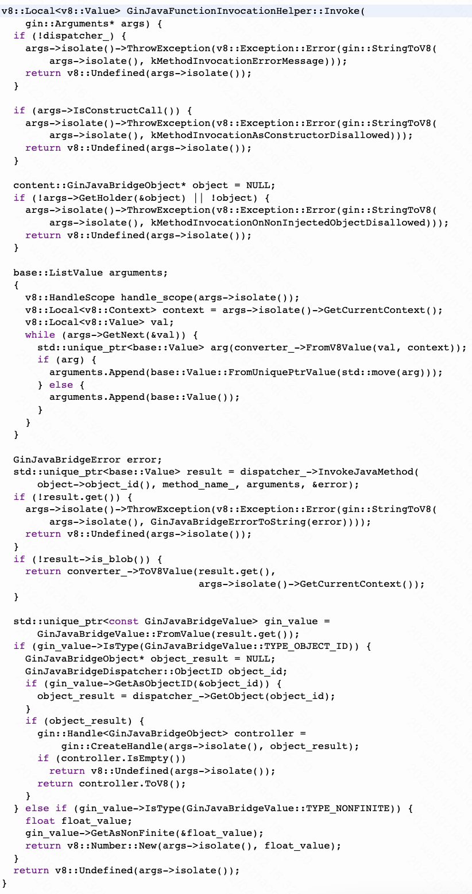

为了和前端业务交互，一般情况下都会提供Bridge功能供前端调用，今天我们就来讲讲这套机制。

通常情况下，我们会使用webview的addJavascriptInterface接口添加接口方法，我们就从这个接口开始看。

checkThread方法就不看了，webview的方法调用要求和webview初始化的线程相同（通常是ui线程）。

一路向下进入到AwContents的addJavascriptInterface方法中。

传入AwContents对象懒加载JavascriptInjector对象。

在构造Injector时初始化持有的GinJavaBridgeDispatcherHost。

回到addJavascriptInterface方法里继续往下。

在获取到Injector对象后，会调用其AddInterface方法进行接口注入。

可以发现，在此方法中会先尝试判断是否此对象已经注入过了，如果没有的话再走AddObject方法，添加成功后会通过WebContents发送消息。

AddObject方法会狗仔GinJavaBoundObject对象，将对应的java对象信息存储在此处，并生成objectId记录下来。

GinJavaBoundObject构造时，会持有对应class的java引用，注意此处并没有将类中的方法对应初始化。

在添加完接口方法后，内核便建立了java对象和桥的映射关系。

然后在RenderFrame创建后，会创建GinJavaBridgeDispatcher。同时在前文中创建过的GinJavaBridgeDispatcherHost，也会执行RenderFrameCreated方法。在这里会创建一个GinJavaBridgeMessageFilter用于接收所有和JavaBridge相关的消息并进行处理。之后将GinJavaBridgeDispatcherHost持有的named_objects遍历，发送message通知GinJavaBridgeDispatcher去同步更新他持有的named_objects。

这里由于chromium是多进程架构的，在android中如果采用多进程模式，Browser和Render进程之间通讯是通过IPC进行的，所以采取了IPCMessage的方式进行同步，保证处于Browser的GinJavaBridgeDispatcherHost和处于Render的GinJavaBridgeDispatcher中持有的named_objects内容相同。

同时当h5侧去尝试调用客户断的Bridge方式时，也会通过GinJavaBridgeDispatcher发送消息至GinJavaBridgeDispatcherHost进行相关处理。

h5侧的bridge调用会分为两个阶段。当v8接收到桥调用时，首先是对检索函数对象，检索由GinJavaBridgeObject::GetNamedProperty方法进行处理。

如果是第一次调用，就会调用至GinJavaBridgeDispatcherHost的OnHasMethod方法中。

走到GinJavaBoundObject::HasMethod中，会先调用EnsureMethodsAreSetUp方法确保methods_信息正确。

在这个方法里，会通过JNI方法里获得method信息，并构造JavaMethod对象存储这些信息，再将对象存储进methods属性中。

回到GinJavaBridgeObject::GetNamedProperty方法中，将HasJavaMethod结果返回给known_methods_存储，这样下次调用同一个方法就不需要再次发IPC消息查询。继续往下，走到GetFunctionTemplate方法中。

CreateFunctionTemplate会在v8中创建一个用于执行c++方法的javascript方法。创建后会保存在template_cache_中供下次重复使用。

第二阶段，当方法真正被执行时，会走到render中的GinJavaFunctionInvocationHelper::Invoke方法中。

这里这里你只需要知道是在根据需要转换参数类型，并通过dispatcher发送IPCMessage传递给Browser中的GinJavaBridgeDispatcherHost即可。

在这个方法中，会创建GinJavaMethodInvocationHelper，并调用其Invoke方法。但是注意，这个类和上面的同名的类，并不是同一个类。

在Browser中的GinJavaMethodInvocationHelper::Invoke方法中，会完成数据类型的转化并真正的根据映射调用JNI到java方法中，并将执行方法的结果进行返回。返回给Render中的GinJavaMethodInvocationHelper::Invoke方法中继续执行。Render中的GinJavaMethodInvocationHelper::Invoke收到result后，会再次在v8中进行类型转换，并最终返回给前端。

到这里，android上JavaBridge的注册和调用逻辑就基本完成了。一般情况下，我们还会在桥里调用webview.evaluateJavascript方法将一些结果返回给h5侧，本质上是通过字符串拼接的方式提交一段js语句至v8进行执行，从而实现对象赋值的效果。但是v8的js执行是队列形式的，这意味着即使你的桥很快的收到了执行信息并且完成了执行，前端也可能等很久才收到桥执行的结果，这就有可能造成一些逻辑上的问题。这一块的逻辑我们后续在探讨v8相关的知识后再详细展开。

总结一下：
- Java侧的addJavascriptInterface方法会在内核中生成对应的GinJavaBoundObject对象，并且在RenderFrame创建后会在JS侧window上挂载对应名称的对象。
- 在某个对象首次执行方法时，会走入EnsureMethodsAreSetUp方法中，将该对象的所有方法生成JavaMethod对象并添加在内存缓存methods_中。
- 方法执行时，会从render中的GinJavaFunctionInvocationHelper::Invoke向下执行到browser中的GinJavaFunctionInvocationHelper::Invoke，再通过JNI执行到Java侧逻辑后向上返回结果。

小Tips：
- 由于JavaBridge对象和mehtods方法均需要再内核侧及Js侧初始化对象并建立映射关系，所以适当考虑将桥合并可能可以减少这部分耗时。如全局只提供一个JavaBridge.invoke方法，在invoke方法里面再根据参数寻找真正要实现的Java方法，将关系仅保留在Java侧，可以使得Js/内核侧每次均是调用同一个对象的同一个方法，以达到减少耗时的目的。
- 新版RN提出了JSI的能力来解决Js侧和Java侧通讯耗时的问题，从原理上可以优化不少，但也会带来些内存问题和改造成本。chromium内核其实也可以做一些修改实现JSI，感兴趣的小伙伴可以查询了解下相关知识。