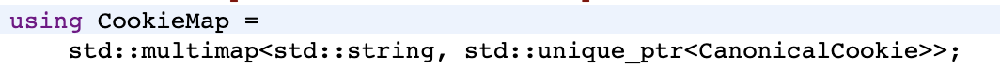

Cookie机制是webview主要机制之一，今天我们来看看Cookie在webview中是怎么运行的吧。

首先还是从初始化逻辑开始：

一般情况下，我们所有cookie相关的操作，都是从CookieManager.getInstance开始

和初始化webview一样，也需要加载dex/so然后拉起WebViewFactoryProvider，但并不需要拉起WebViewProvider。

一路顺着调用走到实际构造的方法中。可以看到并没有做太多操作。主要是启动了cookieStore的taskRunner。

再看我们常用的setCookie方法，目前有两个接口，一个是同步接口，一个是在callback中回调的异步接口：

实际逻辑对应的是以下两个方法：

这里无论是同步接口还是异步接口，均是将任务提交到上面的CookieStoreTaskRunner排队执行。并且此TaskRunner是一个SingleThreadTaskRunner，是单线程排队处理的。

继续看实际执行Cookie设置任务的方法，可以看到通过CanonicalCookie::Create方法，构造了内部所接受的Cookie对象，在Create方法里，会将参数中的cookie值按照规范格式进行解析，并判断过期时间是否有效，是否是secured等等，然后将对象返回回来。

拿到CanonicalCookie对象并检查后，会走到实际的set方法里。MojoCookieManager一般是用来跨进程调用的，对cookie的设置逻辑并不会有区别，这里不做展开。我们直接看GetCookieStore的SetCanonicalCookieAsync方法。

首次GetCookieStore的时候，会对cookie_store进行初始化。从CookieStoreFactory中的CreateCookieStore方法可以看到，这里初始化的是子类CookieMonster，这个类也是Cookie机制中的核心类。

同时也初始化了存储cookie的DB并让CookieMonster持有。

创建后，让我们继续往下走到实际执行Cookie设置的方法里。可以看到调用了DoCookieCallbackForHostOrDomain方法，并在其callback里面调用了SetCanonicalCookie方法。

在DoCookieCallbackForHostOrDomain方法里，会先调用FetchAllCookiesIfNecessary方法，将db中的cookie加载到内存对象cookies_中。

其中cookies_对象是一个multimap集合，key是有效的域名，value则是指向CanonicalCookie对象的指针。

在加载完cookies_后，会走入SetCanonicalCookie方法里，这是一个很大的方法，这里我们跳过有效性检查等逻辑，直接看设置的代码。

此处设置前会先尝试移除同域同key且需要呗删除的cookie对象。

然后进入设置方法，可以看到如果判断是更新入db的，会将cookie对象存入db，在添加入内存中的cookies_对象。

在设置完cookie后，会运行GarbageCollect方法，对cookies_进行清理。如果单域名下cookie数超过180个或者存储的所有cookie数超过3300个，就会执行清理，清理数为单个域名30个或者整体清理300个。

最后将执行结果回调给上层。

看完了cookie的设置逻辑，我们再看看客户端侧常用的获取cookie的接口逻辑。

直接从cookie_manager.cc看起，可以看到也是同样的提交任务到CookieStoreTaskRunner排队执行，这就意味着取和设置均会按提交任务的时机排队执行，如果你在开了两个异步线程并行get和set，那么get返回的结果就完全不可预料。

同样的，也会先走到DoCookieCallbackForUrl，里面会先调用FetchAllCookiesIfNecessary方法，如果cookies_没有初始化则将db中的cookie加载到内存对象cookies_中。

继续往下，会走到CookieMonster的GetCookieListWithOptions方法里。遍历获取后通过Options筛选出符合条件的cookie列表，然后回调返回结果。

这里的options，是在前面初始化传入的，是一些条件和配置项，其中需要注意的是，自89开始，http和https被视作非同域(SameSite)。意味着即使是同一个host，除非在cookie的属性中，主动修改SameSite的属性，否则你往https中设置的cookie，http仍旧读不到对应cookie的值，反之亦然。

再来看RemoveAllCookies，同样是提交到CookieStoreTaskRunner排队执行，执行逻辑在CookieMonster中，会删除cookies_中的所有数据，并且调用FlushStore方法刷新到db中，这里就不再做详细描述。

总结一下：

- CookieManager.getInstance方法会加载webview的dex/so，并拉起WebViewFactoryProvider，但不会拉起WebViewProvider，并且在异步调用时不会阻塞ui线程。
- Cookie的set/get/removeAll方法，都是提交到CookieStoreTaskRunner排队执行，谁先提交谁先执行。
- Cookie的存储在内部会有内存缓存和db持久化存储。CookieManager的初始化并不会将db数据加载到内存中，而是首次调用到CookieStore的时候才会去加载。大部分cookie操作都是操作内存对象然后更新db。