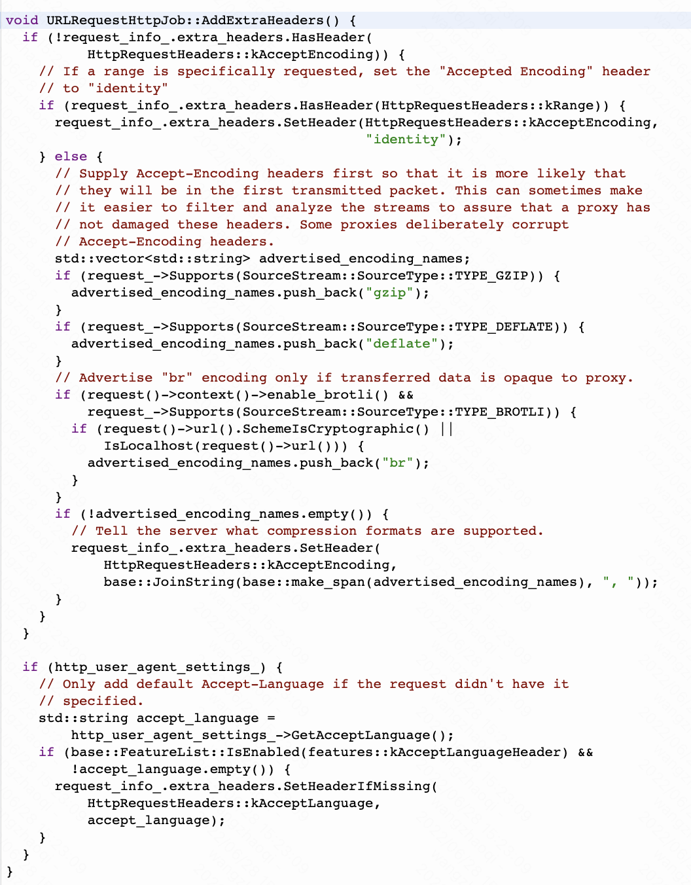
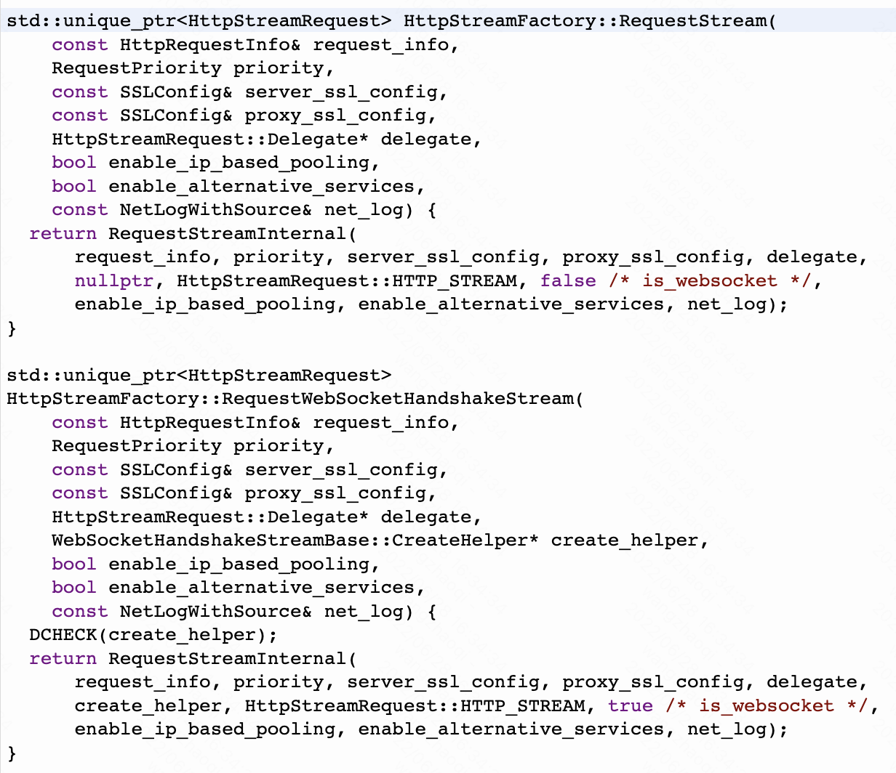

今天我们聊聊chromium中的网络机制，在android应用中，使用的是cornet。

网络模块中，最顶层的对象是URLRequestContext。这个类持有发出请求所需的基础信息。由URLRequestContextBuilder进行创建。当chromium需要发起请求时，就会创建一个URLLoader对象，URLLoader调用URLRequestContext的CreateRequest方法创建URLRequest开始网络流程。我们就从这里作为起点开始了解。

创建完成后，URLLoader调用URLRequest的start方法，开始请求流程。

在这个方法的最后一行，会通过URLRequestContext持有的JobFactory来创建Job，再传给StartJob方法开始执行，我们先看CreateJob方法。URLRequestJobFactory会根据请求类型创建一个URLRequestJob，这里我们以http请求为例。

创建完成后，回到URLRequest的StartJob方法中。

这里对Job进行了一大堆配置的设置和检查，然后走入Start方法中。

在URLRequestHttpJob的Start方法中，将UrlRequest的参数保存到requestInfo。根据是否拥有cookie权限，决定读取Context中的全局的cookie信息存入FirstPartySetMetadata中并进入OnGotFistPartySetMetadata方法中。

这里主要是设置header，先设置常见的Referer，Gzip等header信息。

然后是设置当前域名的cookie信息，如果没有cookie权限，则直接进入StartTransaction方法中。如果拥有cookie权限，进入AddCookieHeaderAndStart方法中，从Context持有的CookieStore中按照规则获取需要注入的cookie信息，并存入URLRequest中，再进入StartTransaction方法中。

一路往下进入StartTransactionInternal方法中。

尝试获取transaction，如果不为空，则直接进入其RestartWithAuth方法中，如果为空，则调用context持有的HttpTransactionFactory的CreateTransaction方法中。

此处的HttpTransactionFactory是在URLRequestContextBuilder执行build方法时配置的。如果开启了HttpCache能力，则配置的为HttpCache对象，否则为HttpNetworkLayer对象。

创建完HttpTransaction对象后，对其进行配置，并走入到对应HttpTransaction的Start方法中。这里我们假设上文初始化时配置了HttpCache。

HttpCache会从内存（ActiveEntry）和磁盘上检查是否有符合条件的Cache，有则直接返回。如果没有，则会发一条STATE_SEND_REQUEST的消息至loop，消息接收执行后，会进入DoSendRequest方法，最后进入到HttpNetworkTransaction的Start方法中进行网络请求。

在HttpNetworkTransaction的Start方法中配置request信息，然后提交nextStep事件到loop进行下一步。

我们这里略过loop中的其他步，进入DoCreateStream方法中。

此处调用HttpStreamFactory创建HttpStream。

创建HttpSteamFactoryJobController并调用Start方法。

创建HttpStreamRequest，进入Loop中，跳过其他步骤，进入DoCreateJob中。

处理预建联逻辑。如果成功，调用Preconnect并返回ok。

如果不是Preconnect，则继续往下，进入CreateMainJob方法中创建HttpStreamFactory::Job。

然后处理AlternativeProxy逻辑。

进入HttpStreamFactory::Job的Start方法中。

一路往下看，跳过其他步骤，进入到DoInitConnection方法中。

继续向下，走入到ClientSocketPoolManager的InitSocketHandleForHttpRequest方法中。

在InitSocketPoolHelper这个方法中，会寻找是否有空闲的可用Socket，如果没有，则创建一个TrasnportConnectJob，然后创建一个StreamSocket并建立连接。

回到HttpStreamFactory::Job的loop中继续往下，走入到DoCreateStream方法中。

如果不使用spdy，则创建一个HttpBasicStream返回给HttpNetworkTransaction。

回到HttpNetworkTransaction中，创建Stream完成后，继续往下，一路经过DoInitStream，DoInitRequestBody，DoBuildRequest等 方法后，进入DoSendRequest方法。

在这个方法中，HttpBasicStream会发送请求，并等待服务端的响应。当收到响应头后，会发送给HttpNetworkTransaction进行读取。这里主要的处理类是HttpStreamParser。解析完响应头后，HttpStreamParser会向上传递至URLRequest和URLLoader。

然后开始读取body，URLLoader会发起64k的正文读取指令一路传递给HttpNetworkTransaction，进入到DoReadBody方法中。

同样是交给HttpStreamParser执行具体的读取。Parser会每读取不超过64kb的数据，就将数据从pipe中传递给IPC的cache buffer中进行传递，同时pipe会申请新的buffer，继续发起读取请求，直至body内容被完全读取返回给URLLoader的调用方。

完成数据传递后，URLLoaderFactory会释放URLLoader，从而销毁对应的URLRequest。当HttpNetworkTransaction执行DoReadBodyComplete时，会判断Socket是否可以重用，如果可以就会将HttpBasicStream放回pool，以供下次直接复用。

总结一下：

- chromium的目前使用的网络底层为cornet，在engine初始化时会创建CornetContext，使用CornetContextAdapter适配网络模块抽象层接口。
- URLRequestContext持有通用配置，在网络模块初始化或使用时由对应的URLRequestContextBuilder进行创建和管理。
- 当调用方需要发送请求时，URLRequestContext会创建URLLoader对象，并调用CreateRequest方法。
- 根据请求类型，创建对应的URLRequestJob，如URLRequestHttpJob，URLRequestFtpJob等等，然后进入StartJob方法。
- 以Http请求为例，URLRequestHttpJob为RequestInfo配置header等信息。进入StartTransaction方法，获取context中持有的HttpTransactionFactory，构造HttpTransaction对象。
- 如果开启了Cache能力，HttpCache从内存和磁盘上检查是否存在符合的Cache，如果有，则直接返回cache内容。如果没有，则转入到HttpNetworkTrasnaction进行网络请求。
- HttpNetworkTransaction通过HttpStreamFactory创建HttpSteam，以HttpBasicStream为例，创建时会初始化HttpSteamParser，并从ClientSocketPoolManager的pool中寻找可复用的SteamSocket，如果没有，则创建一个新的，并执行connect。
- 获取到可用的HttpSteam后，执行DoInitSteam，DoInitRequestBody，DoBuildRequest等一连串方法后，进入DoSendRequest中发送请求。
- HttpSteamParser发送请求后，收到并解析响应头，向上传递回URLRequest和URLLoader。
- URLLoader处理后，分配RawDataPipe，从pipe中获取IPC Buffer并发送大小为64k的数据读取请求。请求到达HttpStreamParser后，执行ReadResponseBody方法，读取到数据后（不大于64k），通过出pipe传递回上方，同时如果body没有读完，pipe会申请新的buffer并再次发起读取请求，直至body内容被完全读取。
- response内容传递完成后，URLLoaderFactory释放URLLoader。当执行销毁时，HttpNetworkTransaction会确定socket是否可以复用，如果可以，会加那个HttpBasicSteam返回至Pool中，供后续复用。

Tips:

- preconnect关键字在网络模块中处理，会提前创建连接并放入pool中供后续实际请求时直接复用。
- chromium在主文档请求时对主host的连接也会放在pool中，这会加速非跨域请求的速度。
- 从HttpTransaction到HttpStream到HttpStreamParser，均是由状态驱动的loop结构实现。
