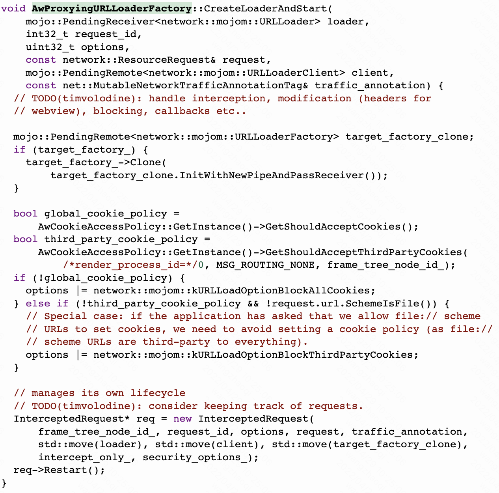

客户端上web页面加载的开始，始于webview的loadUrl和loadDataWithBaseUrl方法。我们顺着这个方法，简单了解一下页面加载的流程。

顺着java方法往下，走到AwContents的loadUrl方法里，可以看到在4.4版本之前，webview支持在loadUrl方法里传入js语句，会在这里转发到evaluateJavaScript方法去执行。

无论是loadUrl还是loadDataWithBaseUrl方法，都会走到同一个loadUrl方法里，但是传入的LoadUrlParams对象中的参数是有区别的，后面也会根据LoadUrlParams来采取不同的执行流程。

继续往下，走入到NavigationController的LoadUrlWithParams方法里。

再到NavigateWithoutEntry方法中，这个方法逻辑很多，我们挑着看。

对于非Js语句的url，此处会根据上面的LoadUrlParams参数创建NavagationRequest对象。

检查此次加载是否是reload，如果是，找到之前的FrameNavigationEntry进行复用。

这此方法最后传入request对象走入到Navigator的navigate方法中。

也是一个很长的逻辑，这里我们只关注最后走入到了NavigationRequest的BeginNavigation方法中。

继续走入到BeginNavigationImpl方法中。

这里会走入到java侧的WebviewClient中的ShouldOverrideUrlLoading方法回调中，供上层进行处理，如果回调结果为true，就会中止页面加载逻辑，交给上层执行自己的逻辑。

此处检查了CSP策略，如果没问题的话，走入到StartNavigation中。

为当前Frame分配对应的RenderProcessHost。

处理重定向逻辑，注意此处如果Params里面baseUrlForDataUrl不为空，即对应入口是调用的loadDataWithBaseUrl方法，会将其historyUrl设置为传入的url，而不是当前真实的url，这种方法在回退页面栈的时候，是会有影响的。

往下，这里初始化了NavigationThrottleRunner。

回到BeginNavigationImpl方法继续向下，在经过其他一系列拦截/错误检查后，走入到WillStartRequest方法中。

可以看到这里通过上文说的throttleRunner发送了一条WillStartRequest的event。

监听到事件后，走入OnStartChecksComplete方法中。

跳过一些列复杂的参数配置和分叉逻辑，走入了NavigationURLLoader::Create并且调用了loader的start方法。

Create方法按照loaderType返回对应的URLLoader，我们这里是走入到NavigationURLLoaderImpl的构造方法。此处主要是做一些请求前的准备。

这里创建了ResourceRequest对象。

根据url的scheme添加对应的NonNetworkUrlLoaderFactory。

获取NetworkLoaderFactory对象。

在构造方法最后定义了StartClosure。

然后就是loader的start方法，这里是直接run了上面的StartClosure，执行StartImpl方法。

在这个方法里，按需创建NavigationLoaderInterceptor，常用于ServiceWorker，预取等能力。NavigationLoaderInterceptor使得页面在将请求移交给默认URLLoader之前拦截导航请求并执行对应逻辑。

然后走入到Restart方法，再执行到MaybeStartLoader方法中。

在这个方法一路往下，构造了StartInfo，并且执行了前面获取到的UrlLoaderFactory的CreateLoaderAndStart方法。

在AwProxyingUrlLoadingFactory中，会先交给java侧的webviewClient的shouldInterceptRequest方法拦截。

接收到结果后，走入InterceptResponseReceived，再走入到ContinueAfterIntercept。

如果拦截并返回了WebResourceResponse，则走入AndroidStreamReaderUrlLoader，对response内容进行读取，否则继续走入到其他UrlLoaderFactory，比如如果是调用LoadDataWithBaseUrl执行页面加载，则会走入ContentURLLoaderFactory，流程类似，这里我们不一一赘述，直接以发起网络请求的UrlLoaderFactory为例。

是构造URLLoader，并提交给net模块进行网络请求，关于网络模块后面会单独讲解，此处不详细描述。

网络模块成功获取到response后，将response发送给UrlLoaderClient。

render进程中的NavigationURLLoader收到后，会开始解析结果，并将结果渲染绘制上屏幕。这块的细节也会单独拿出来描述，此处仅描述流程。

总结一下整体流程中的几个环节

- java侧通过loadUrl/loadDataWithBaseUrl方法开始加载流程
- broswer进程的NavigationController开始执行LoadURLWithParams方法
- 走入到renderHost中Navigator的navigate方法，在这过程中会回调到WebviewClient中的ShouldOverrideUrlLoading方法
- 继续走入到loader中NavigationUrlLoader的Start方法
- 按参数创建对应的UrlLoaderFactory，并按顺序执行CreateLoaderAndStart方法
- 如果有某个UrlLoader得到了结果，则会发送IPCMessage通知UrlLoaderClient
- render中的NavigationURLLoader收到response后，会开始执行解析，并将解析结果绘制渲染上屏。
